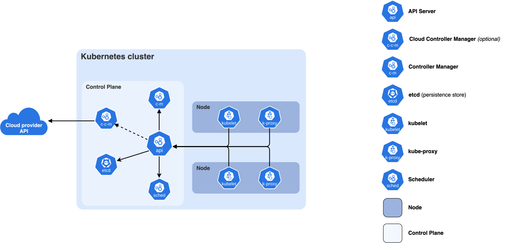

# Kubernetes Cluster Components



## 1. Overview

A Kubernetes cluster consists of a **Control Plane** and one or more **Worker Nodes**. Each architectural part contains different Kubernetes components, with each component responsible for a specific function.

The cluster is broadly divided into the following **architectural parts**:

* **Control Plane:** Manages the cluster's overall state and coordinates cluster operations.

* **Worker Nodes:** Provide the environment required to run application workloads and containers.

Kubernetes also supports **Add-ons**, which extend the functionality of the cluster with additional services such as DNS, resource monitoring, and cluster-level logging.

---

## 2. Control Plane Components

The Control Plane manages the overall state of the Kubernetes cluster. It makes decisions about scheduling, maintains the desired state, and provides the API through which users and other components interact with the cluster.

Here's a brief overview of the main components of Control Plane:

### 2.1. kube-apiserver

The `kube-apiserver` is the central management component of Kubernetes. It exposes the Kubernetes HTTP API and acts as the primary interface for communication between cluster components and users.

**Responsibilities:**

* Exposes the Kubernetes API for cluster management.
* Validates and processes API requests.
* Authenticates and authorizes requests.
* Coordinates access to cluster data stored in `etcd`.
* Provides the interface used by `kubectl` and other Kubernetes components.

**Example:**

When a user executes `kubectl apply -f deployment.yaml`, the request is sent to the `kube-apiserver`, which validates and processes the requested changes.

### 2.2. etcd

`etcd` is a distributed, consistent key-value store used by Kubernetes to store the cluster's state and configuration.

**Responsibilities:**

* Stores Kubernetes cluster data.
* Maintains information about Pods, Deployments, Services, ConfigMaps, and other Kubernetes resources.
* Stores the desired and current state information managed through the Kubernetes API.
* Provides consistent data storage for the Control Plane.

**Important:** `etcd` is a critical component of the Kubernetes Control Plane. Losing its data without a valid backup can result in the loss of cluster configuration and state.

### 2.3. kube-scheduler

The `kube-scheduler` is responsible for selecting suitable Worker Nodes for newly created Pods that have not yet been assigned to a node.

**Responsibilities:**

* Identifies Pods that require scheduling.
* Evaluates available Worker Nodes based on resource requirements and scheduling constraints.
* Selects a suitable node for each Pod.
* Considers CPU, memory, node selectors, affinity, taints, and tolerations when making scheduling decisions.

**Example:**

When a Deployment creates a new Pod, the scheduler evaluates the available Worker Nodes and selects a suitable node based on the Pod's requirements and the cluster's scheduling policies.

The scheduler assigns the Pod to a node, but it does not start the container. The `kubelet` on the selected node handles that responsibility.

### 2.4. kube-controller-manager

The `kube-controller-manager` runs Kubernetes controllers that continuously monitor the cluster and work to maintain the desired state.

**Responsibilities:**

* Monitors Kubernetes resources through the API server.
* Runs controllers responsible for managing different Kubernetes resources.
* Detects differences between the desired state and the current state.
* Takes corrective actions to bring the cluster back to the desired state.

**Examples of controllers:**

* **Node Controller:** Monitors node health and responds when nodes become unavailable.
* **Deployment Controller:** Ensures that Deployments maintain the required number of replicas.
* **ReplicaSet Controller:** Maintains the desired number of Pod replicas.
* **Namespace Controller:** Manages the lifecycle of namespaces.

**Example:**

If a Deployment requires three replicas but only two Pods are running, the relevant controllers work to create another Pod and restore the desired replica count.

### 2.5. cloud-controller-manager (Optional)

The `cloud-controller-manager` integrates Kubernetes with cloud provider APIs. It allows Kubernetes to manage cloud-specific resources and infrastructure.

This component is optional and is generally used when Kubernetes runs on supported cloud infrastructure.

**Responsibilities:**

* Integrates Kubernetes with cloud provider APIs.
* Manages cloud-based load balancers.
* Helps manage cloud-backed node information.
* Supports cloud storage and networking integrations through relevant controllers.

**Example:**

When a Kubernetes Service is configured with `type: LoadBalancer`, a cloud controller can communicate with the cloud provider to provision an external load balancer.

---

## 3. Worker Node Components

Worker Nodes provide the environment in which application workloads run. Each node requires components responsible for communicating with the Control Plane, managing Pods, and running containers.

### 3.1. kubelet

The `kubelet` is an agent that runs on each Worker Node. It communicates with the Kubernetes API server and ensures that the Pods assigned to its node are running as expected.

**Responsibilities:**

* Registers the node with the Kubernetes cluster.
* Watches for Pod specifications assigned to the node.
* Communicates with the container runtime to create and manage containers.
* Monitors Pod and container health.
* Reports node and Pod status to the API server.
* Executes configured container health checks.

**Example:**

When the scheduler assigns a Pod to a Worker Node, the `kubelet` on that node receives the Pod specification and instructs the container runtime to start the required containers.

### 3.2. kube-proxy (Optional)

The `kube-proxy` is a network component that runs on nodes and implements Kubernetes Service networking by maintaining network rules.

**Responsibilities:**

* Maintains network rules for Kubernetes Services.
* Enables traffic forwarding to the appropriate backend Pods.
* Supports Service types such as `ClusterIP` and `NodePort`.
* Implements Service traffic distribution using the configured networking mechanism.

**Important:** `kube-proxy` is optional if another component provides the required Service networking functionality.

Some Kubernetes networking implementations replace `kube-proxy` with their own mechanisms.

### 3.3. Container Runtime

The container runtime is responsible for running containers on Worker Nodes. Kubernetes uses the Container Runtime Interface (CRI) to communicate with supported runtimes.

**Responsibilities:**

* Pulls container images from registries.
* Creates and starts containers.
* Stops and removes containers.
* Manages the container lifecycle.
* Provides the runtime environment required by Pods.

**Examples:**

* `containerd`
* `CRI-O`

**Important:** Docker Engine is not directly supported as a Kubernetes runtime through CRI. However, Docker-built images can still run on Kubernetes when they are compatible with the container runtime.

---

## 4. Kubernetes Add-ons

Add-ons extend Kubernetes functionality by providing services that are not included as mandatory core Control Plane or Worker Node components.

### 4.1. DNS

Kubernetes DNS provides service discovery and DNS-based name resolution within the cluster.

**Responsibilities:**

* Provides DNS resolution for Kubernetes Services.
* Allows Pods to communicate using Service names instead of IP addresses.
* Supports DNS-based service discovery across namespaces.

**Example:**

A Pod can access a Service in the same namespace using its DNS name:

```text
my-service
```

A Service in another namespace can be accessed using:

```text
my-service.my-namespace.svc.cluster.local
```

CoreDNS is a commonly used DNS solution in Kubernetes clusters.

### 4.2. Web UI (Kubernetes Dashboard)

The Kubernetes Dashboard is a web-based user interface for managing and monitoring Kubernetes resources.

**Responsibilities:**

* Provides a graphical interface for viewing cluster resources.
* Displays information about Pods, Deployments, Services, and other resources.
* Allows authorized users to manage Kubernetes resources.
* Provides an interface for inspecting resource status and configuration.

The Dashboard is an optional add-on and requires appropriate access controls.

### 4.3. Container Resource Monitoring

Container resource monitoring collects metrics about resource utilization across the cluster.

**Responsibilities:**

* Monitors CPU and memory usage.
* Provides resource utilization information for nodes and Pods.
* Helps administrators identify resource constraints.
* Supports capacity planning and performance troubleshooting.

Metrics Server is commonly used to provide resource metrics to Kubernetes components such as the Horizontal Pod Autoscaler.

For long-term monitoring, additional solutions such as Prometheus can be deployed.

### 4.4. Cluster-level Logging

Cluster-level logging collects and stores logs from applications and cluster components in a centralized location.

**Responsibilities:**

* Collects container and application logs.
* Centralizes logs from multiple Worker Nodes.
* Supports log searching and troubleshooting.
* Helps administrators investigate application errors and operational issues.

Common logging solutions include:

* Elasticsearch
* Fluent Bit
* Fluentd
* Loki

Kubernetes does not provide a built-in cluster-level logging backend. An external logging solution must be deployed when centralized log management is required.

---

## 5. Kubernetes Cluster Architecture

The following diagram illustrates the relationship between the Control Plane and Worker Nodes.

```text
                  Kubernetes Cluster
                          |
          +---------------+---------------+
          |                               |
    Control Plane                    Worker Nodes
          |                               |
  +-------------------+         +-------------------+
  |   kube-apiserver  |         |      kubelet      |
  |                   |         |                   |
  |       etcd        |         |    kube-proxy     |
  |                   |         |                   |
  |  kube-scheduler   |         | Container Runtime |
  |                   |         |                   |
  | kube-controller-  |         |   Application     |
  |     manager       |         |      Pods         |
  +-------------------+         +-------------------+
                                          |
                                +-------------------+
                                |   Worker Node 2   |
                                |                   |
                                |      kubelet      |
                                |    kube-proxy     |
                                | Container Runtime |
                                |                   |
                                |   Application     |
                                |      Pods         |
                                +-------------------+

             Cluster Add-ons
             - DNS
             - Monitoring
             - Logging
             - Dashboard
```

*Note: This is a logical representation. Actual component placement and networking may vary depending on the cluster architecture.*

---

## 6. Component Communication and Workflow

The following example describes how Kubernetes components work together when a user creates a Deployment.

1. **User submits a Deployment:** The user executes `kubectl apply -f deployment.yaml`. The request is sent to the `kube-apiserver`.

2. **API request processing:** The API server authenticates and authorizes the request, validates the resource configuration, and stores the updated cluster state in `etcd`.

3. **Controller reconciliation:** The Deployment controller detects the new Deployment and ensures that the required ReplicaSet is created. The ReplicaSet controller then works to create the required number of Pods.

4. **Pod scheduling:** The `kube-scheduler` identifies the newly created Pods that do not have an assigned node and selects suitable Worker Nodes.

5. **Pod execution:** The `kubelet` on each selected Worker Node detects the assigned Pods and instructs the container runtime to pull the required images and start the containers.

6. **Pod status reporting:** The `kubelet` monitors the Pods and reports their status to the API server.

7. **Service networking:** If the application is exposed through a Kubernetes Service, the cluster networking components provide connectivity to the application Pods.

Throughout this process, Kubernetes controllers continuously reconcile the actual state with the desired state.

---

## 7. Architecture Flexibility

Kubernetes supports different deployment architectures depending on infrastructure, availability requirements, and operational needs.

Common deployment models include:

* **Single-node cluster:** The Control Plane and application workloads run on the same node. Commonly used for development and testing.
* **Multi-node cluster:** The Control Plane manages multiple Worker Nodes. Suitable for distributed workloads and local learning environments.
* **Highly available Control Plane:** Multiple Control Plane nodes provide redundancy and help maintain cluster availability if a Control Plane node fails.
* **Cloud-based cluster:** Kubernetes integrates with cloud infrastructure to manage networking, storage, and load balancing.

The exact architecture depends on the deployment requirements. Not every cluster needs every optional component.

---

## 8. Summary

| Component                  | Role                                              | Deployment               |
| -------------------------- | ------------------------------------------------- | ------------------------ |
| `kube-apiserver`           | Exposes the Kubernetes API and processes requests | Control Plane            |
| `etcd`                     | Stores cluster state and configuration            | Control Plane            |
| `kube-scheduler`           | Assigns Pods to suitable nodes                    | Control Plane            |
| `kube-controller-manager`  | Runs controllers to maintain the desired state    | Control Plane            |
| `cloud-controller-manager` | Integrates Kubernetes with cloud providers        | Control Plane (Optional) |
| `kubelet`                  | Manages Pods and containers on a node             | Every node               |
| `kube-proxy`               | Implements Service networking rules               | Every node (Optional)    |
| Container Runtime          | Runs containers                                   | Every node               |
| DNS                        | Provides cluster-wide DNS resolution              | Add-on                   |
| Web UI                     | Provides a graphical management interface         | Add-on (Optional)        |
| Resource Monitoring        | Collects resource utilization metrics             | Add-on                   |
| Cluster-level Logging      | Centralizes application and cluster logs          | Add-on                   |

Understanding these components and their responsibilities is essential for deploying, operating, troubleshooting, and maintaining Kubernetes clusters.

## 9. References

* [Kubernetes Cluster Architecture](https://kubernetes.io/docs/concepts/architecture/)
* [Kubernetes Components](https://kubernetes.io/docs/concepts/overview/components/)
* [Kubernetes Container Runtimes](https://kubernetes.io/docs/setup/production-environment/container-runtimes/)
* [Kubernetes Controllers](https://kubernetes.io/docs/concepts/architecture/controller/)
* [Kubernetes Services](https://kubernetes.io/docs/concepts/services-networking/service/)
